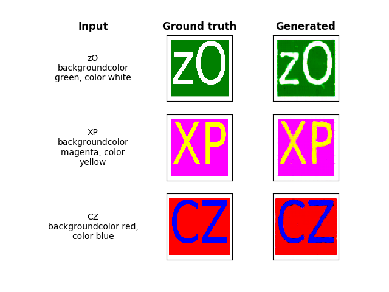
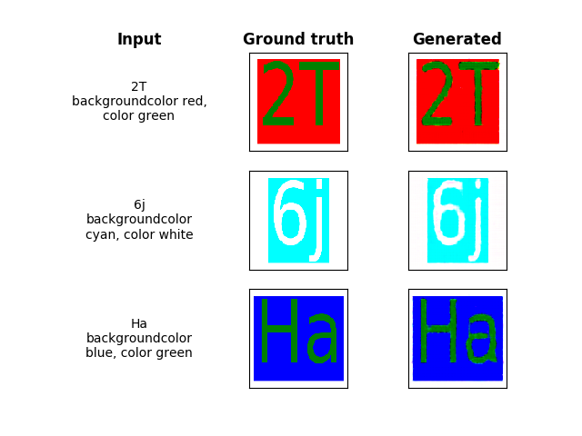
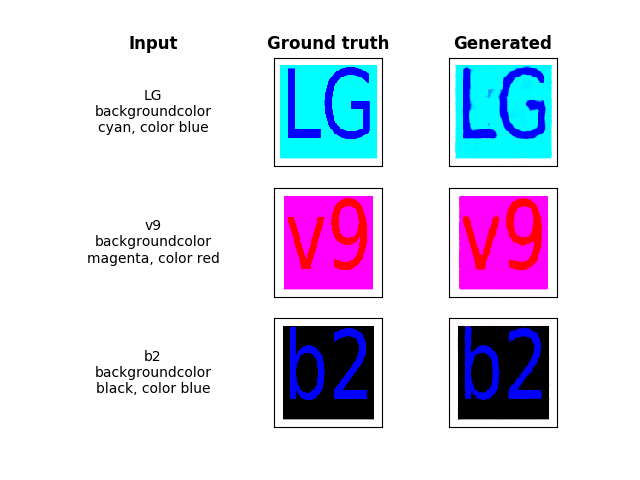
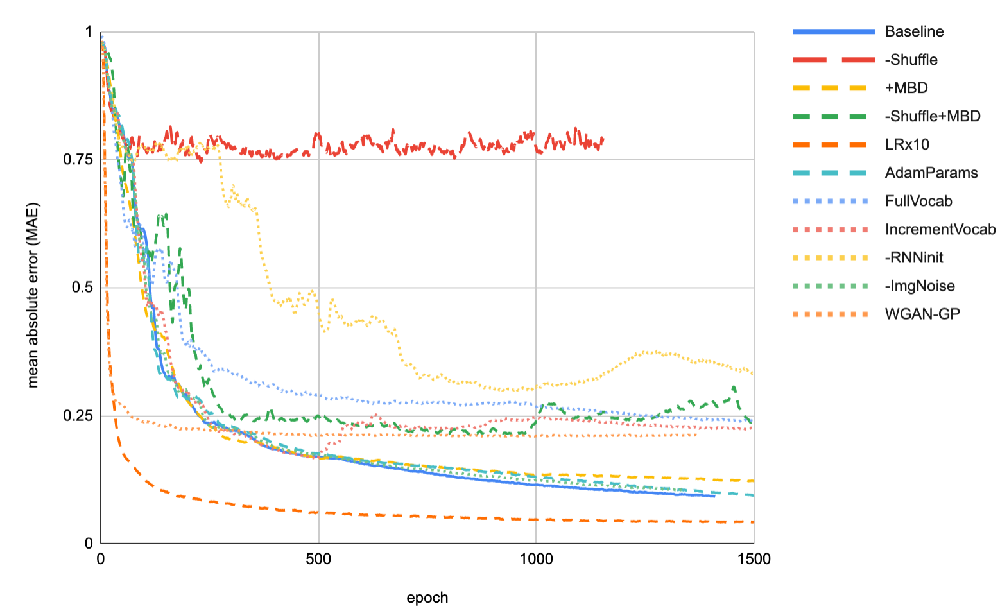
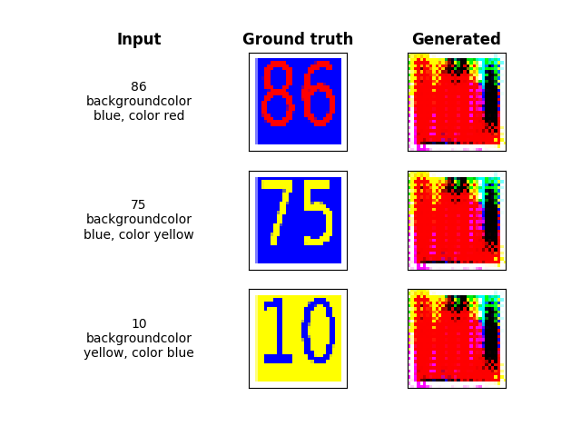
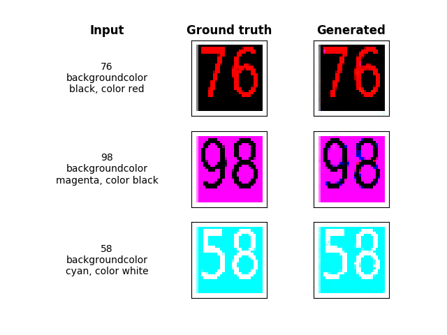
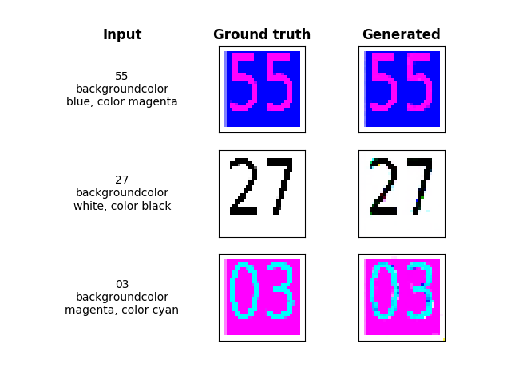

# tf-text2image
 
| **Work In Progress** |
| --- |

This project uses a neural network to generate images from text using TensorFlow 2.

The text is composed of two parts:

* *chars*: The characters to be displayed in the image
* *spec*: A specification for the format of the text. For instance the color (so far), font, policy etc.

The data is generated synthetically by sampling the chars and specs randomly and plotting the image using matplotlib.

The advantage of synthetically generated data is that we can gradually increase the difficulty of the task as the model gets better at it. The ultimate goal is to use a Generative Adversarial Network (GAN).

# Part 1: Training a generator directly

Since our data does not contain any noise ie the mapping from text to images is deterministic, we can train a neural network in a supervised fashion.

Our generator has a simple structure. First, two distinct RNNs read in the variable length text inputs (`chars` and `spec`) to transform them into a fixed length encoding.

This encoding is then fed through a full-collected layer to add a non-linear transformation on the one hand and to increase its size.

Finally, the encoding initializes a feature-map that is up-sampled via fractional-strides convolutions to return an image of size 128x128x3.

Since the output of the generator is later fed into the discriminator of a GAN, we would like it to be centered around 0. Therefore, we use `tanh` as the activation of the last convolution.

## A loss function for `tanh`

In what follows, we propose a loss function tailored to the `tanh` activation. Its gradient possesses the same desirable properties as when using the `sigmoid` in combination with the binary cross-entropy.

Note that since the `tanh` can be rewritten using the `sigmoid` function:

It would have been more convenient - and equivalent up to a constant - to use the sigmoid function and normalize that data as part of the discriminator model. Yet, since this is a personal project, let's have some fun with math :-)

By analogy of the binary cross-entropy applied to the `sigmoid`, we suggest the following loss function:

Where *`y`* represents the ground truth value of the pixels, and *`p=tanh(h)`* is the prediction of the network, with *`h`* representing the output of the last hidden layer ie. the logits.

### Gradient properties

We show next that this loss function gives desirable properties for the gradient, when used with `tanh`.

Let's compute the gradient of the loss *`L`* with respect to the logits *`h`*:

The derivative of the activations *`p`* with respect to the logits *`h`* takes a simple form:

Using this in the equation just above, shows that the gradient propagated through the activations is directly proportional to the difference between activations and targets (ie no vanishing nor exploding gradients):

### Numerically stable version

Inspiring from [tensorflow](https://github.com/tensorflow/tensorflow/blob/master/tensorflow/python/ops/nn_impl.py#L124), we develop numerically stable version of the loss *`L`* from the logits *`h`*:

To avoid an exponent of a positive number, which might be too large, let's rewrite this for the case where *`h<0`*:

Both cases *`h<0`* and *`h>0`* can be rewritten as follows, where we drop the constant:

## Results

### Generator

We train the generator for 500 epochs (each epoch is made of 64 batches of size 16) and get the following convergence.

Since our data is generated synthetically, it covers the whole input space ie it contains all possible combinations of `chars` and `spec`.
We can therefore safely evaluate the model on the training data (we verify indeed that the metrics on a separate validation set are indistinguishable from the training set).

A sample of generated image can be seen below:

### Discriminator

We also train a discriminator using the converged generator. We observe that near 100% accuracy can be achieved after only a few epochs:

# Part 2: A Generative Adversarial Net

Next, we train a GAN on our synthetic data. The GAN is composed of the generator and the discriminator just mentioned. When building these networks, we considered the general advice for DCGANs in [Radford et al. 2015](https://arxiv.org/pdf/1511.06434.pdf).

Note that our GAN differs from a standard GANs and could be qualified as "fully-conditional GAN". That is, we only have conditional data as input, no latent variable `z`. This is similar to [Isola et al. 2016](https://arxiv.org/abs/1611.07004), who generate an image conditional on another image. Their generator takes therefore the form of a U-net which leverages local features of the conditional image directly to generate the output image. In other words, the fact that the conditional and generated data are in the same domain, allows them can leverage the conditional information very well. This is in contrast to our problem: the text representation at the input is very remote to the image domain at the output.

Another difficulty of our problem is the high regularity images that have to be generated; both text and background are perfectly uniform and edges very sharp. This makes it very easy for the discriminator to distinguish real from fake images without having to learn anything about the content in the image, hence not providing meaningful gradient to the generator.

It is for these two reasons that this task turned out to be very challenging. Training of the GAN was very unstable (as it is known to be) and we had to introduce many improvements to the vanilla GAN to get good results.

It is interesting to note that because the link between our text input and our images is deterministic. We can therefore define an exact evaluation metric for our GAN. This is contrary to most literature in the field. We decide to use the mean absolute error (MAE) since it seemed to be more stable than RMSE.

## Ablation study

The following graph shows the MAE per epoch for various setups of our GAN. Below we discuss the changes we had to make to generate high quality images. We show the default parameters in series `Baseline`.

##### Shuffled text as fake data
Our GAN manages quickly to produce images with the right background-size and colors. It does however not manage to generate clearly identifiable characters. This is because the discriminator is able to distinguish real from fake based on other features such as the smoothness of edges. It will never have to identify individual characters and match them against the text. To mitigate this, we also feed the discriminator with real images associated with random text and train it to identify it as fake data. This forces the discriminator to actually read the image and text properly and provide good gradients to the generator. This method is generalizable to other cGANs and to our knowledge, not present in the literature.

In practice, we take a batch of real images and text and shuffle either `chars`, `spec` or both. Most often, with 60% probability, we shuffle characters only, forcing the discriminator to learn our vocabulary.

In the graph above, series `-Shuffle` shows training without this feature. Consequently, convergence is basically non-existent. We did find ways to get convergence without this feature (eg lowering the learning rate and MBD (see next section)). Yet, this feature remains the most essential improvement brought to our model. We strongly believe that this approach could also help convergence of other cGANs and that it should be exploited further in research.

##### Minibatch Discrimination
One problem of our GAN (and GANs in general) is mode-collapse, ie all generated images are almost identical, as shown in the image below. Once mode collapse occurs, there is no way to escape it, since it is a stable local optima to our min-max problem. To help the discriminator detect this, [Salimans et al. 2016](https://arxiv.org/abs/1606.03498) suggest Minibatch Discrimination (MBD). This technique allows the discriminator to look at multiple images from one batch and detect features common between them. For this technique to work, fake and real images have to be provided to the discriminator in separate batches (see next section).

It turns out that with text-shuffling, this method is actually counterproductive as shown in series `+MBD`. In many situations where training was unstable, this method did however help as is shown in series `-Shuffle+MBD`. We conclude therefore, that MBD acts as a patch to instabilities, but introduces training difficulties on its own and should therefore be avoided if possible. We also note that, MBD introduces many parameters to the discriminator and makes it consequently a lot slower.

##### Separate real & fake batches
We feed batches of fake and real images separately to the discriminator. Besides simplifying the implementation a little, this has also the effect of accelerating and improving convergence. This is because doing so effectively increases the learning rate of the discriminator. Like most public implementations, we use the same parameters when training the discriminator and generator. It seems however likely that the generator is much harder to train, since it is effectively a lot deeper from a gradient perspective. It does therefore require more conservative optimization parameter than the discriminator. It is also known that the generator can only be as good as the discriminator. Allowing the discriminator to converge faster, can thus only be beneficial. To our surprise and to our knowledge, using higher learning rate for the discriminator (and in general more suited optimization parameters) is not explored in the literature.

##### Learning rate
The literature advises the use of a low learning rates to facilitate convergence. In order to achieve convergence with a majority of our setups, we require a learning rate of `5-e5`, which turns out to be about one matter of size lower than is common (`2e-4` is advised for [DCGANs](https://arxiv.org/pdf/1511.06434.pdf)). Our final setup however,
is so stable, especially due to text-shuffling, that training succeeds with a learning rate of `5e-4` as shown in series `LRx10`. For our ablation studies, we keep a low learning rate to make sure the instability are not due to this factor.

##### Adam
As is common with GANs, we use Adam for optimization. In many setups however, and in accordance with [Radford et al. 2015](https://arxiv.org/pdf/1511.06434.pdf), the default values for `β` did not work. We had to reduce `β1`, which controls momentum, from `.9` to `.5` and `β2`, which controls adaptiveness to the gradient norm, from `.99` to `.9. This indicates that the direction and norm of our gradients change significantly over the course of the optimization.

In the graph of our ablation study, series `AdamParams` has been run with the default parameters. The difference is marginal for our baseline setup, which is again due to text shuffling: Since the shuffled data does not come from our generator, this method has the effect of making the discriminator training more decoupled from the current state of the generator. This tends to stabilize the gradients across epochs for the discriminator. An additional benefit of text-shuffling, we haven't mentioned so far.

##### Limited vocabulary
Our original vocabulary constituted of numbers and case-sensitive letters has size 62. This turns out to be too big to converge successfully. We therefore reduce our vocabulary to numbers only, thus having size 10. This means that our dataset has size 6400. At such a small dataset size, we are essentially learning to overfit (despite methods like dropout and layer-norm mitigating against this). The challenge is however, to get such a difficult to train model to overfit. As shown here, many improvements are required to get there.

In series `FullVocab` we train the model with the full vocabulary size, ie an effective dataset size of 246K. Our model does converge, yet much slower.
This shows that our method does not strictly rely on overfitting. The limited vocabulary allows just for accelerated training, hence faster comparison of different model variants.

We also experiment with a variant where the first 500 epochs run with the default vocabulary size of 10. Every 10 epochs thereafter, we introduce one character to the vocabulary. The idea is to first get a model overfit on a small data. Since it is trained with methods to avoid overfitting, it will actually manage to learn features that it would not have leaned on a too big, hence too difficult dataset. As we increase the size of the dataset, the hope is that these features can be gradually generalized on the whole dataset. In other words, learning generalized features is easier to be done gradually than in one shot, for hard to train setups such as GANs.

Series `IncrementVocab` shows that this idea does indeed have merit. It is worth noticing that in our case of generated data, increasing the difficulty of the dataset comes naturally. This method is however generalizable to any dataset by just increasing the size of the datasets per epoch. Many successful methods to avoid overfitting have been developed in the past decade. Using overfitting initially is therefore acceptable, to overcome training instabilities, and we believe it to be an interesting idea for research worth exploring further.

##### Pretrained text-RNN
As mentioned above, our approach differs from usual (c)GANs by the fact that our input is text and not images and categorical one-hot encodings. The presence of the text RNNs makes our network very deep. We find that a way to accelerate convergence is to initialize the RNN with weights pretrained supervisedly (see Part 1). Still, never do we fix these weights and propagate gradients all the way through.

Series `-RNNinit` shows that even with randomly initialized weights, training convergence. All credit goes again to training the discriminator with shuffled data.
As mentioned in the section about Adam, the fact that the discriminator sees real and fake data which is not generated by the generator, allows it to learn the meaning of our conditional data efficiently. Only this makes training a neural network which provides the conditional data possible. To our knowledge, this is the first time this has been done.
Note that we do not propagate the generator's gradient into the RNN. Doing so would allow it to sabotage the RNN and prevent the discriminator from using conditional information.

##### Noise
As suggested by [Arjovsky et al. 2017](https://arxiv.org/abs/1701.04862) adding noise to real and fake images before feeding them to the discriminator stabilizes training. As mentioned above, our images are extremely regular. Adding noise is particularly useful to prevent the discriminator from distinguishing between real and fake images just based on  the uniformity of colors. One nice feature of Keras is that we do not manually add noise to the data, but instead do this as a specific layer of the network.

Series `-ImgNoise` relates to this feature in our ablation study. Impact is again minimal in combination with text-shuffling, yet this feature had more impact in less powerful setups.

### A note on Wassersstein-GANs
To overcome convergence issues, we also implement one of the most advanced approaches to GANs, a [Wasserstain GAN](https://arxiv.org/abs/1701.07875).
We observe that a WGAN does achieve a much faster convergence initially compared to the standard cross-entropy loss. This is because, as is the promise of this approach, the gradients never saturate, which they otherwise do when the generator is poor.

Unfortunately, as shown in series `WGAN-GP`, convergence stagnates quickly before the generator is able to recognizable characters. It turns out that the cross entropy is able to produce better gradients further down in the training, which seems to be the most challenging part of training our GAN. Our observation is in line with [Lucic et al. 2018](https://arxiv.org/abs/1711.10337), who conclude that many versions of "improved" GANs do effectively not beat the implementation of the original paper.

To make the Wasserstein GAN work, we again had to introduce a few improvements.

##### Gradient Penalty
We found that imposing the Lipschitz constraint via weight clipping does prevent convergence. [Gulrajani et al. 2017](https://arxiv.org/abs/1704.00028) impose a soft unit norm constraint on the gradient with respect to the input. Implementing this was challenging because of an [issue in Keras](https://github.com/tensorflow/tensorflow/issues/36436). We therefore had to optimize the constraint in a separate step (as opposed to a single step which optimizes also the distance between the distributions of real and fake images). This is however not a blocking issue since we even go further to train real and fake images separately in any case.

##### Shared optimizer
It turned out that optimizing the constraint separately the distance measure made training very sensitive to the value of the balancing factor `λ`. To mitigate this, we use the same optimizer for both steps. The stabilization comes from the adaptive gradients included in Adam, effectively coordinating the gradients between both steps.

##### No momentum
We use Adam without momentum (`β1`=0). This is because the fast convergence of the WGAN-GP causes the discriminator to change a lot between steps, and hence varying the direction of the generator's gradients making momentum counterproductive.

### What didn't work

We investigated various approaches to improving performance, many of which failed. We list just a few below for completeness:

##### Latent variable
We attempted feeding the generator with a latent variable despite our images having no latent unobserved component. The idea is that the randomness coming from `z` might facilitate generating realistic images independently of the text initially. Only later the generator might make its output conditional on the text. We observed however that adding latent noise was detrimental to generation ability.

##### Discriminator only steps
The original GAN [paper](https://arxiv.org/abs/1406.2661) suggests training the discriminator only for `k` steps and then the generator as well for one step. We find that this slows down convergence. The fact that this is not needed is most likely due to the effectively higher learning-rate for the discriminator introduced by training real and fake images separately (see above).

## Results
Samples form our baseline GAN are shown below:

We notice that the model has difficulties generating matplotlib-green which is `(0, 0.5, 0)` in RGB. Since is the only color with a value of .5,which is where the sigmoid/tanh, has maximum slope. The output value of the model must therefore be very precise to output this value, which is hard.

