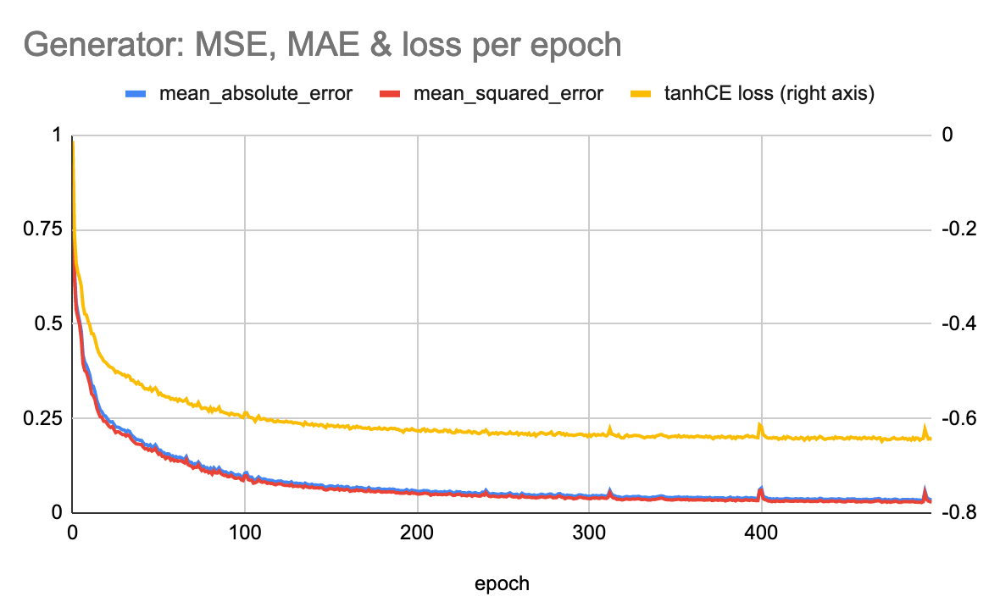
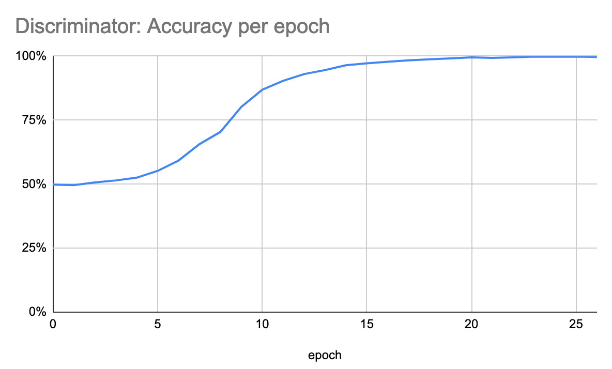

# tf-text2image
 
| **Work In Progress** |
| --- |

This project uses a neural network to generate images from text using TensorFlow 2.

The text is composed of two parts:

* *chars*: The characters to be displayed in the image
* *spec*: A specification for the format of the text. For instance the color (so far), font, policy etc.

The data is generated synthetically by sampling the chars and specs randomly and plotting the image using matplotlib.

The advantage of synthetically generated data is that we can gradually increase the difficulty of the task as the model gets better at it. The ultimate goal is to use a Generative Adversarial Network (GAN).

# Part 1: Training a generator directly

Since our data does not contain any noise ie the mapping from text to images is deterministic, we can train a neural network in a supervised fashion.

Our generator has a simple structure. First, two distinct RNNs read in the variable length text inputs (`chars` and `spec`) to transform them into a fixed length encoding.

This encoding is then fed through a full-collected layer to add a non-linear transformation on the one hand and to increase its size.

Finally, the encoding initializes a feature-map that is up-sampled via fractional-strides convolutions to return an image of size 128x128x3.

Since the output of the generator is later fed into the discriminator of a GAN, we would like it to be centered around 0. Therefore, we use `tanh` as the activation of the last convolution.

## A loss function for `tanh`

In what follows, we propose a loss function tailored to the `tanh` activation. Its gradient possesses the same desirable properties as when using the `sigmoid` in combination with the binary cross-entropy.

Note that since the `tanh` can be rewritten using the `sigmoid` function:

It would have been more convenient - and equivalent up to a constant - to use the sigmoid function and normalize that data as part of the discriminator model. Yet, since this is a personal project, let's have some fun with math :-)

By analogy of the binary cross-entropy applied to the `sigmoid`, we suggest the following loss function:

Where *`y`* represents the ground truth value of the pixels, and *`p=tanh(h)`* is the prediction of the network, with *`h`* representing the output of the last hidden layer ie. the logits.

### Gradient properties

We show next that this loss function gives desirable properties for the gradient, when used with `tanh`.

Let's compute the gradient of the loss *`L`* with respect to the logits *`h`*:

The derivative of the activations *`p`* with respect to the logits *`h`* takes a simple form:

Using this in the equation just above, shows that the gradient propagated through the activations is directly proportional to the difference between activations and targets (ie no vanishing nor exploding gradients):

### Numerically stable version

Inspiring from [tensorflow](https://github.com/tensorflow/tensorflow/blob/master/tensorflow/python/ops/nn_impl.py#L124), we develop numerically stable version of the loss *`L`* from the logits *`h`*:

To avoid an exponent of a positive number, which might be too large, let's rewrite this for the case where *`h<0`*:

Both cases *`h<0`* and *`h>0`* can be rewritten as follows, where we drop the constant:

## Results

### Generator

We train the generator for 500 epochs (each epoch is made of 64 batches of size 16) and get the following convergence.

Since our data is generated synthetically, it covers the whole input space ie it contains all possible combinations of `chars`and `spec`.
We can therefore safely evaluate the model on the training data (we verify indeed that the metrics on a separate validation set are indistinguishable from the training set).

A sample of generated image can be seen below:

### Discriminator

We also train a discriminator using the converged generator. We observe that near 100% accuracy can be achieved after only a few epochs:

