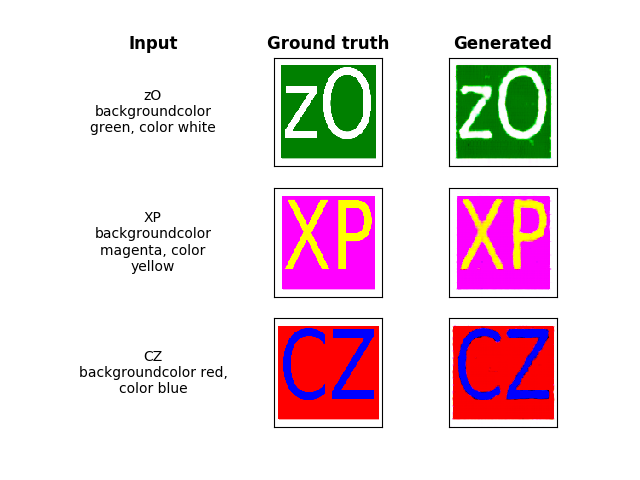
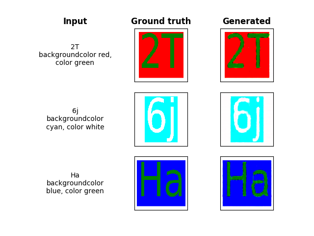
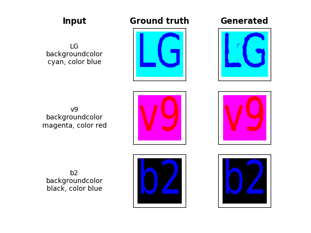

# tf-text2image
 
| **Work In Progress** |
| --- |

This project uses a neural network to generate images from text using TensorFlow 2.

The text is composed of two parts:

* *chars*: The characters to be displayed in the image
* *spec*: A specification for the format of the text. For instance the color (so far), font, policy etc.

The data is generated synthetically by sampling the chars and specs randomly and plotting the image using matplotlib.

The advantage of synthetically generated data is that we can gradually increase the difficulty of the task as the model gets better at it. The ultimate goal is to use a Generative Adversarial Network (GAN).

# Part 1: Training a generator directly

Our generator has a simple structure. First, two distinct RNNs read in the variable length text inputs (`chars` and `spec`) to transform them into a fixed length encoding.

This encoding is then fed through a full-collected layer to add a non-linear transformation on the one hand and to increase its size.

Finally, the encoding initializez a feature-map that is up-sampled via fractional-strides convolutions to return an image of size 128x128x3.

Since the output of the generator is later fed into the disciminator of a GAN, we would like it to be centered around 0. Therefore, we use `tanh` as the activation of the last convolution.

By analogy of the binary cross-entropy applied to the `sigmoid`, we suggest the following loss function:

Where *y* represents the ground truth value of the pixels, and *p=tanh(x)* is the prediction of the network, with *x* representing the output of the last hidden layer ie. the logits.

### Preliminary results

